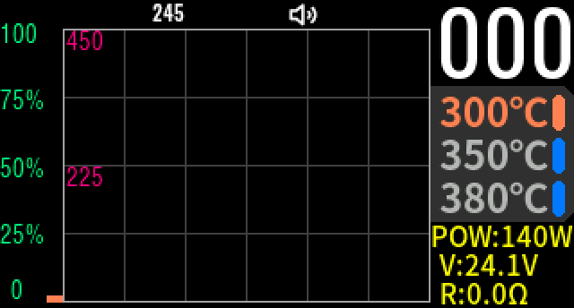
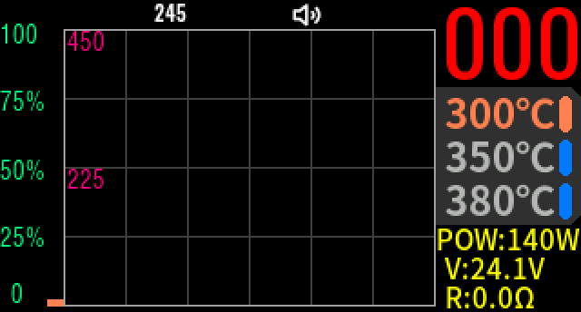
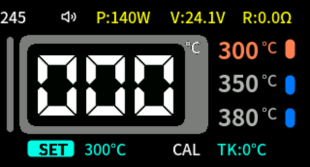
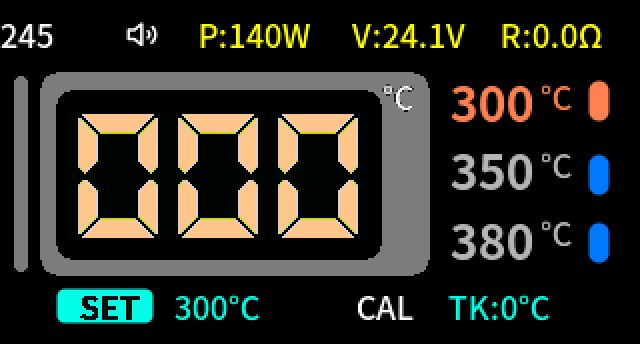

# ts1m_fw_mod

MINIWARE TS1M はんだごてステーションのファームウェア解析と改造の記録。

対象ファーム: `TS1MAPPV202` (`TS1M_Master_APP_V202_EN.hex` / `_CN.hex`、画面表示は `SWVer: 2.2`)

## 現状

解析は進行中。ファームの構造、こて先判定ロジック、設定項目、DFU 書き込みの制約までは判明している。
パッチを当てて任意コードを実行させる手法も実機で動作確認済み。

温度関連の RAM 変数 (現在温度・目標温度・動作モード) とビープの鳴らし方をエミュレーションで特定し、
目標温度到達通知・自動ブースト・ブースト表示のパッチ (`patches/`) を作成した。
**実機で動作確認済み** (2026-09-27)。エミュレーション (仮想パネルでの画面確認を含む) でも確認している。

- [ANALYSIS.md](ANALYSIS.md) — ファーム本体の解析結果
- [EMULATION.md](EMULATION.md) — Unicorn によるエミュレーションの手順と知見
- [ts1m_emu.py](ts1m_emu.py) — エミュレータのハーネス
- [hex2bin.py](hex2bin.py) — Intel HEX → raw binary 変換
- [patches/](patches/) — 目標温度到達通知 + 自動ブースト + ブースト表示のパッチ (ANALYSIS.md 11章)

## 分かっていること (要点)

- MCU は **WCH CH32F208WBU6** (Cortex-M3、QFN68、96MHz)。SDK ドライバとピン配置から推定し、実機のチップ ID `0x2080043C` で確定。Keil ビルド
- アプリは `0x08010000`〜`0x080773C4`。ブートローダ (`0x08000000`〜`0x0800FFFF`) は配布物に含まれない
- こて先は 245 / 210 / 115 / H100 に対応。**210 と 115 は電気的に区別せず手動選択**
- `TS80P` の種類コードは存在するが**到達不能**
- 起動時に チップ UID を照合し、不一致なら `Demo Mode` で停止する
- 工場検査モードは、工場校正レコードが壊れている場合のみ自動で起動する
- **エミュレータ上でメインループまで起動でき、UART デバッグ出力が取得できる**
- 現在温度 `0x2000023E`、PID の目標温度 `0x200001F4`、動作モード `0x2000023C` (0.1℃単位。エミュレーションで特定し、パッチの実機動作で裏付け)
- ビープはブザーオブジェクト `0x20000330` の `beep(pattern)` (`0x08012219`) で鳴らす
- 以前フック置き場にしていた `0x0802AFC4` は空きではなくビットマップの一部だった。未使用の FatFs テスト関数 `0x0802849C` (348 B) を使う
- 文字列描画は `drawString(str, x, y, font, fg, bg, flag)` (`0x08014834`、色は RGB565 でスタック渡し)
- UI はページ構造。加熱画面 (ページ 1) に入ると動作モードが作業になる

## パッチ

```
python3 patches/build.py              # -> TS1M_Master_APP_V202_EN_notify_boost.hex / .bin
python3 patches/test_notify_boost.py  # エミュレータでのシナリオ試験 (数分)
python3 patches/screenshot.py         # 加熱画面を仮想パネルに描画 (通常 / ブースト中、数分)
```

| 機能 | 動作 |
| --- | --- |
| 目標温度到達通知 | 設定温度の ±3.0℃ に初めて入ったら 2回ビープ。設定変更・スリープ復帰で再び有効 |
| 自動ブースト | 一度到達した後、10.0℃ 以上低い状態が 300ms 続いたら目標を +20.0℃ (上限 450℃)。回復で終了、20秒で打ち切り |
| ブースト表示 | ブースト中は加熱画面の現在温度の数字が白から赤になる (7セグ風表示ではピンク寄り) |

### 画面 (ブースト表示)

エミュレータの仮想パネルで描画した加熱画面 (`python3 patches/screenshot.py docs/images` で再生成できる)。
現在温度の数字はエミュレーションでは更新されないため `000` のまま。

| | 通常 | ブースト中 |
| --- | --- | --- |
| 通常表示 |  |  |
| 7セグ風表示 |  |  |

- 変更箇所は 3つの 4バイト命令 (`bl` への置換) と、未使用関数の領域に置いたフック本体だけ
- ブーストで上げた目標は PID 呼び出しの間だけ使い、すぐ元に戻す。ヒーター制御と安全装置のコードには触れていない
- パラメータ (しきい値・上昇幅・表示色) は `patches/notify_boost.S` 先頭の `.equ` で変更できる
- 元 HEX の該当行だけを書き換えるので、行数と構造は元と同じ

### 診断パッチ: チップ ID 表示

```
python3 patches/build.py -p chipid    # -> TS1M_Master_APP_V202_EN_chipid.hex
```

ホーム画面左上のこて先名 ("245" など) の代わりに、チップ ID (`0x1FFFF704`) を 16進8桁で表示する。
ヒーター制御には触れない。確認後は元のファーム (または notify_boost 版) を書き戻す。
notify_boost と同じ空き領域を使うので、両方を同時には入れられない。

| 表示 | チップ (WCH SDK `DBGMCU_GetCHIPID` の一覧) |
| --- | --- |
| `208004xC` | CH32F208WBU (QFN68)。**TS1M 実機の値は `2080043C`** |
| `208104xC` | CH32F208RBT (LQFP64) |
| `203...` / `205...` / `207...` | CH32F203 / F205 / F207 |

(x はリビジョン)

## DFU 書き込み

本体を USB マスストレージにして HEX をコピーする方式。コード領域・文字列領域とも書き込みは反映される。

HEX 全体を再シリアライズすると反映されない可能性を疑っているが、**未確認**。
詳細は ANALYSIS.md の「7. DFU 書き込みについて」を参照。

## エミュレーション

`ts1m_emu.py` で Unicorn 上に起動できる。UART デバッグログが丸ごと取れるので、
SWD が無い状況では最も情報量の多い手段。

```
pip install unicorn capstone
python3 hex2bin.py TS1M_Master_APP_V202_EN.hex
python3 ts1m_emu.py
```

UID 照合の回避、周辺レジスタのモデル化、Unicorn 側の落とし穴 (読み出しフックが効かない、
書き込みフックで異常終了する) については EMULATION.md にまとめてある。

主なオプション:

| オプション | 内容 |
| --- | --- |
| `force_tip` / `skip_res` | こて先判定を固定し、抵抗値チェックを飛ばす |
| `defaults=True` | 設定の初期値・温度校正・電源電圧校正を入れる (無いと温度も電圧も 0) |
| `work_mode=True` | ヒーターを作業状態に保ち、毎周測定と PID を走らせる |
| `lcd=True` | パネルへの送信を 320×172 のフレームバッファに再現し、`save_png()` で画像にする |
| `adc_hook` | 測定点ごとに ADC 値を注入する |

## 注意

ファームウェアの改変は自己責任で。ヒーター制御と安全装置 (過熱しきい値、抵抗値チェック、450℃上限) には手を触れないこと。
実機で試す前に、必ず元のファームウェアを書き戻せる状態を確保すること。
